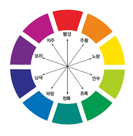

# 웹에서 색 표현하기

## 16진수

16진수 표기법은 알고 있을 것이다.

이처럼 #ffff00 처럼
#RRGGBB 라는 값을 사용 하여

00~ff 까지 색상의 진함을 통해 표현할 수 있으며 
범위는 #000000 ~ #ffffff 까지이다.

만약 #ffff00 처럼 두자리씩 중복될 경우 #ff0 으로 줄여서 표기할 수 있음.

## rgb, rgba

**기본형**
`rgb(red 값, green 값, blue 값);`
`rgb(red 값, green 값, blue 값, alpha 값);`

red, green, blue (0~255) -> 십진수로 표현
alpha(0~1) 값은 불투명도를 나타냄
- 만약 0.5를 표현할거면 .5 라고 표기해도 됨.

## hsl, hsla

hul : 색상
saturation : 채도
lightness : 밝기

**기본형**
`hsl(<hue 값>, <saturation 값>, <ligthness 값>)`
`hsl(<hue 값>, <saturation 값>, <ligthness 값>, <alpha 값>)`

색상은 색의 3요소 중 하나로 각도를 기준으로 **색상을 둥글게 배치한 색상환**으로 표시

채도도 색의 3요소 중 하나로 '%'로 표시
아무것도 섞이지 않은 상태가 채도가 가장 높은 상태

채도가 0%면 회색 톤, 100%면 순색으로 표시

밝기도 %로 표시 0%가 가장 어둡고 100%가 가장 밝음

## 색상 이름 표시

색상의 이름을 알고 있으면 red, black 처럼 잘 알려진 색상 이름도 표시할 수 있음
모든 브라우저에서 표현할 수 있는 색상을 웹안전 색상(web-safe color)라고 하며
- 기본 16가지 색상을 포함해 모두 216가지

## 색상 추출 사이트

색상을 표현하는데 여러가지 방법이 있지만
이름이나 색상 값을 기억하는 것은 어려움

이럴 때 색상을 추출할 수 있는 유틸리티나 온라인 툴을 이용하면 편리함.

[Color Picker](https://www.webfx.com/web-design/color-picker/)