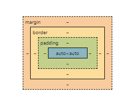

# CSS와 박스 모델

CSS 박스 모델이란 웹 문서의 내용을 **박스 형태**로 정의하는 방법을 가리킴.

## 블록 레벨 요소 & 인라인 레벨 요소

블록 레벨(block-level) : 태그를 사용해 요소를 삽입했을 때 혼자 한줄을 차지하는 요소
한 줄을 차지한다는 것은 해당 요소의 너비가 100%라는 의미.

따라서 왼쪽이나 오른쪽에 다른 요소가 없음
너비나 마진, 패딩 등을 이용해 크기나 위치를 지정하려면 블록 레벨 요소여야 함.

대표적인 예 `<div>, <p>` 태그

----

인라인 레벨(inline-level) : 요소가 줄을 차지하지 않는 요소
즉, 화면에 표시되는 콘텐츠 만큼 영역을 차지하고 나머지 공간에는 다른 요소가 올 수 있음.

따라서 한 줄에 여러 개의 인라인 레벨 요소를 표시할 수 있음

대표적인 예 `, <strong>` 태그

| 종류 | 해당 태그 |
| --- | --- |
| 블록 레벨 태그 | `<p>, <h1>~<h6>, <ul>, <ol>, <blockquote>, <div>, <form>, <hr>, <table>, <fieldset>, <address>` |
| 인라인 레벨 태그 | `, <object>, <br>, <sub>, <sup>, <span>, <input>, <textarea>, <label>, <button>` |

## 박스 모델(box model)

박스 모델은 아래와 같이 구성되어 있음.



실제 콘텐츠 영역
박스와 콘텐츠 영역 사이의 여백인 패딩(padding)
박스와 테두리(border)
여러 박스 모델 사이의 여백인 마진(margin) 등이 요소로 구성

마진이나 패딩은 웹 문서에 하나의 콘텐츠만 표시한다면 반드시 필요하지 않을 수 있지만
다른 콘텐츠들과의 간격이나 배치등을 고려하면 필요한 박스 모델의 중요한 개념임.

### width, height - 콘텐츠 영역의 크기

**기본형**
```css
width: <크기> | <백분율> | auto 
height: <크기> | <백분율> | auto
```

auto : 기본값 -> 콘텐츠 양에 따라 자동을 결정
크기 -> 너비나 높이 값을 px(픽셀)이나 cm(센티미터) 같은 단위로 함께 수치로 지정
백분율 -> 부모 요소에 따라 달라짐(브라우저창)

#### 실제 콘텐츠 크기 계산

모던 브라우저에서 박스 모델의 전체 너비 = width 값 + 좌우 패딩 + 좌우 테두리
인터넷 익스플로러 6에서 width 값 = 콘텐츠 너비 + 좌우 패딩 + 좌우 테두리

따라서 인터넷 익스플로러 6을 고려한 사이트를 기ㅣ획한다면 박스 모델의 width 값을 지정할 때 주의해야 함.

### display - 화면 배치 방법 결정

display 속성을 사용하면 블록 레벨 요소를 인라인 레벨 요소로 바꾸거나 인라인 레벨 요소를 블록 레벨 요소로 바꿀 수 있음

세로로 표시되는 목록을 가로 내비게이션으로 바꿀 때, 한줄로 표시되는 이미지에 여백과 테두리를 추가해 갤러리로 표시할 때 이 방법을 사용함.

**기본형** `display: none | contents | blocks | inline | inline-block | table | table-cell`

외 에도 여러 속성 값이 있음


