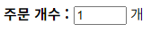

# 사용자 입력을 위한 `<input>` 태그

## `<input>` 태그 - 입력 항목 만들기

기본형 `<input type="유형" [속성="속성값"]>`

폼을 만들다 보면 똑같은 폼 요소가 여러번 사용됨.
예를 들어 회원 가입 폼을 만들 때, 이름 입력 항목이나 주소 입력 항목 등 한 줄짜리 텍스트를 입력할 때 모두 `<input type="text>` 라는 텍스트 필드를 사용함.
이렇게 여러번 사용되는 폼 요소를 구분하기 위해 사용되는 것이 id 속성 -> **HTML 문서 안의 모든 요소에서 사용 가능**

- id 속성의 값은 최소한 한 개 이상의 문자여야 하고, 공백이 있으면 안됨.
- CSS를 이용해 각 속성마다 다른 형태로 꾸밀 수 있음.

```
<input type="text" id="user-name" size="10">
<input type="text" id="addr" size="60>
```
> size 속성은 필드의 길이를 지정하는 속성

### `<input>` 태그의 type 속성에서 사용 가능한 유형

|       유형       |          설명             |
|------|------|
| hidden | 사용자에게는 보이지 않지만 서버로 넘겨지는 값을 가짐 |
| text | 한 줄짜리 텍스트를 입력할 수 있는 텍스트 상자를 넣음 |
| search | 검색 상자를 넣음 |
| tel | 전화번호 입력 필드를 넣음 |
| url | URL 주소를 입력할 수 있는 필드를 넣음 |
| email | 메일 주소를 입력할 수 있는 필드를 넣음 |
| password | 비밀번호를 입력할 수 있는 필드를 넣음 | 
| datetime | 국제 표준시(UTC)로 설정된 날짜와 시간(연,월,일,시,분,초,분할 초)를 넣음 |
| datetime-local | 사용자가 있는 지역을 기준으로 날짜와 시간을 넣음 |
| date | 사용자 지역을 기준으로 날짜(연, 월, 일)을 넣음 |
| month | 사용자 지역을 기준으로 날짜(연, 월)을 넣음 |
| week | 사용자 지역을 기준으로 날짜(연, 주)을 넣음 |
| time | 사용자 지역을 기준으로 시간(시, 분, 초, 분할 초)을 넣음 |
| number | 숫자를 조절할 수 있는 화살표를 넣음 |
| range | 숫자를 조절할 수 있는 슬라이드 막대를 넣음 |
| color | 색상 표를 넣음 |
| checkbox | 주어진 항목에서 2개 이상 선택 가능한 체크박스를 넣음 |
| radio | 주어진 항목에서 1개만 선택할 수 있는 라디오 버튼을 넣음 |
| file | 파일을 첨부할 수 있는 버튼을 넣음 |
| submit | 서버 전송 버튼을 넣음 |
| image | submit 버튼 대신 사용할 이미지를 넣음 |
| reset | 리셋 버튼을 넣음 |
| button | 버튼을 넣음 |

----

### `type="hidden"` - 히든 필드 만들기

히든(hidden) 필드는 화면상의 폼에는 보이지 않지만 사용자가 입력을 마치고 폼을 서버로 전송할 때 서버로 함께 전송되는 요소
보통 사용자에게 굳이 보여 줄 필요가 없지만 관리자가 알아야 하는 것을 hidden 필드로 입력함.

**기본형** `<input type="hidden" name="이름" value="서버로 넘길 값">`

name 속성을 이용해 히든 필드의 이름을 정하고 그에 대한 값을 value 속성을 이용해 서버로 넘겨줌.

### `type="text"` - 텍스트 필드 만들기 

한 줄짜리 일반 텍스트를 입력하는 필드
폼에서 가장 많이 사용하는 요소로 아이디, 이름, 주소 등 텍스트를 입력할 때 사용

**기본형** `<input type="text" [속성="속성값"]>`

텍스트 필드에서 사용할 수 있는 속성

| 속성 | 설명 |
| --- | --- |
| name | 텍스트 필드를 구별할 수 있도록 이름을 붙임 |
| size | 텍스트 필드의 길이를 지정. 즉 화면에 몇 글자 보이도록 할 것인지 지정 |
| value | 텍스트 필드  요소가 화면에 표시될 때 텍스트 필드 부분에 표시될 내용 / 속성을 사용하지 않으면 빈 텍스트 필드 |
| maxlength | 텍스트 필드에 입력할 수 있는 최대 문자 개수를 지정함 |

size - 만약 최대 입력 가능한 글자 수가 10개인데 size를 5로 지정하면 텍스트 필드 크기가 5개 글자 크기에 맞추어져 나머지 5개 글자는 보이지 않음

[예제](./Example/password.html)

### `type = search, url, email, tel` - 분화된 텍스트 필드

url - 반드시 "http://" 로 시작하는 사이트 주소를 입력해야 함.

email, tel 같은 경우 모바일 기기의 웹 브라우저에서 확인해보면
이메일, 전화번호 같은 경우 **가상 키보드 배열이 바뀜**을 알 수 있음
[예제](./Example/url_email_tel.html)

### `type = "number"` - 숫자 입력하기

지정하면 입력 창에 숫자를 직접 입력하는 것이 기본이지만
브라우저에 따라 스핀 박스가 표시되기도 함.

firefox : 

chrome : 


[예제](./Example/number.html)

### `type = "range"` - 슬라이드 막대로 숫자 지정하기

| 속성 | 설명 |
| min | 필드에 입력할 수 있는 최솟값 지정 / 기본 최솟값 0 |
| max | 필드에 입력할 수 있는 최댓값 지정 / 기본 최댓값 100 |
| step | 짝수나 홀수 등 특정 숫자로 제한하려고 할 때 숫자 간격을 지정할 수 있음 / 기본 값 1 생략할 수 있음 |
| value | 필드에 표시할 초기값 |

### `radio, checkbox`

아까 앞에서 다뤘던 내용이다. 
`<label>` 과 같이 사용하며 예제는 다음과 같다. [바로가기](/HTML5/03/03-1/radio_checkbox.html)

| 속성 | 설명 |
| ---- | ---- |
| name | 여러개 있을 경우, 서버의 폼 프로그램에서 라디오 버튼이나 체크박스를 구분하기 위해 이름을 지정
| value | 선택한 라디오 버튼이나 체크박스를 서버로 알려 줄 때 넘길 값을 지정 / 이 값은 영문이거나 숫자며 필수속성임.
| checked | 라디오 버튼의 항목들은 처음에 아무것도 선택되지 않은 상태로 화면에 표시되는데 깁농르로 선택해 놓을 항목이 있다면 checked 속성 사용

라디오 버튼은 여러 개 중에서 하나만 선택하는 것이기 때문에 관련 있는 그룹끼리는 name 속성 값을 똑같이 만듬

### `type = "date, month, week"` - 날짜 표시하기

**기본형** `<input type="date | month | week" [value ="기본 값" 속성="속성값"]>`

위의 기본형에서 `|`는 '또는(or)'의 의미로 날짜와 같이 사용할 수 있음

date : 날짜 선택
month : 월과 연도를 선택
week : 주와 연도를 선택

type="date" 로 지정하면 날짜를 선택했을 때 필드에 "yyyy-mm-dd" 형식으로 연도와 월, 일이 표시됨.
type="month" -> "yyyy-mm"
type="week" 1월 첫째 주를 기준으로 몇 번째 주인지 표시 -> 예를 들어 24번째 주라면 "yyyy-W24"

#### 브라우저마다 다름

- chrome -> 달력 표시
- MS Edge -> dd-mm-yyyy 형태로 입력하라고 텍스트 필드 표시
- 지원하지 않는 인터넷 익스플로러 -> 빈 텍스트 필드

### `type = "time, datetime, datetime-local"` - 시간 지정하기

**기본형** `<input type="time | datetime | datetime-local" [value ="기본 값" 속성="속성값"]>`

| 속성 | 설명 |
| ---- | ---- |
| min | 날짜나 시간의 최솟값 지정 |
| max | 날짜나 시간의 최댓값 지정 |
| step | 스핀 박스의 화살표를 누를 때마다 날짜나 시간을 얼마나 조정할지 지정 |
| value | 화면에 표시할 초기값 지정 |

type - time 시간은 00:00 ~ 23:59
type - datetime or datetime-local 날짜 다음에 키워드 T를 쓰고 24시간제로 시간을 지정 
/ 오후 6시 인경우 -> T18:00

datetime 경우 HTML5에서 제외되었지만 HTML5.1에 다시 채택되었음

type="datetime"의 경우, 날짜와 시간 문자 뒤에 시간대(timezone)를 함께 표시해야 하는데
UTC 기준일 경우 Z 라고만 표시하면 되고, +dd:dd나 -dd:dd 처럼 몇시간 몇 분이 차이 나는지 직접 입력해도 됨.

날짜와 시간을 모두 조절 가능함.

### `type = "submit, reset"`
이 기능은 브라우저 버전 상관없이 사용 가능
**기본형** `<input type="reset | submit" [value="버튼내용"] [속성="속성값"]>`

### 간략
image -> submit 제출 버튼 대신 전송 이미지를 넣을 수 있음
button -> 버튼 넣기
- 예로 들어 버튼을 눌렀을 때 새 창(새 탭)을 여는 자바스크립트 함수를 실행하면 위와 같음
새 창을 여는 window.open() 함수를 연결
`<input type="button" value="새 탭 열기" onclick="window.open()">`
file -> 파일 첨부 (웹 화면에 파일 선택이나 찾아보기 등이 표시 됨.)
- 실제 파일 첨부 버튼에 표시되는 내용(파일명 등)은 웹 브라우저에 따라 달라짐.

